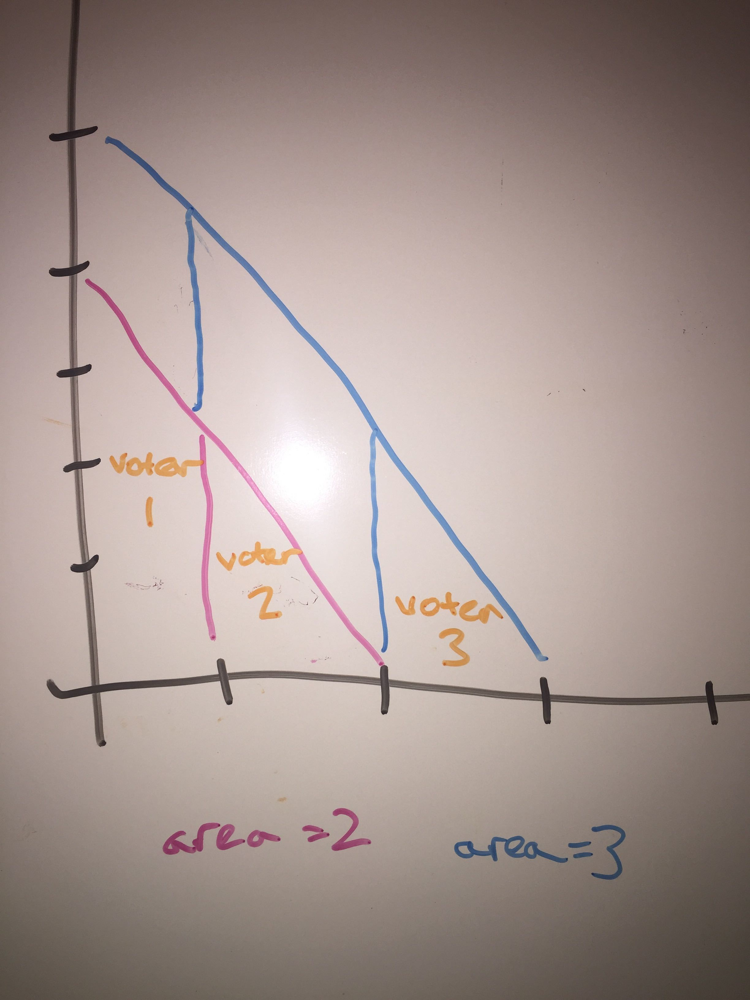
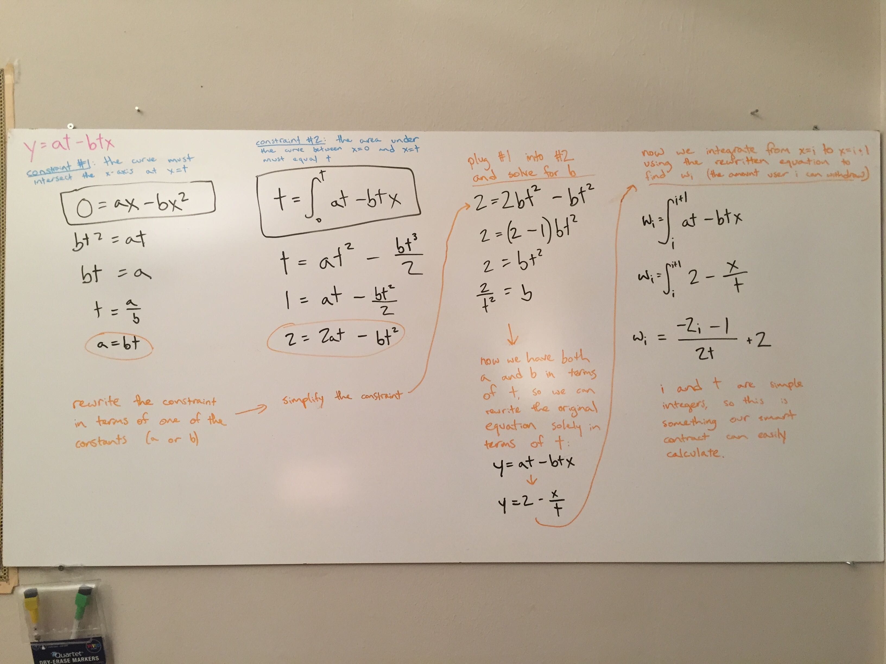
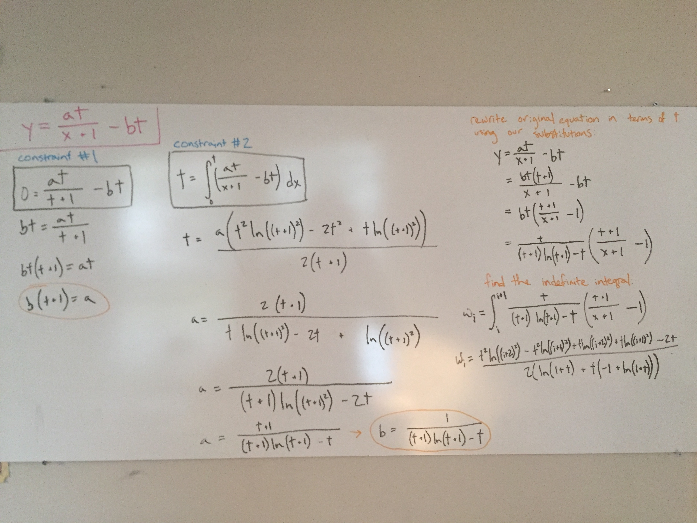
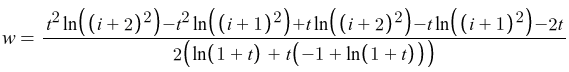

# contracts-curation

Smart contracts for curation markets, charts, etc.


# Incentive design considerations

## I. Are tokens tradable?

**Yes:**
- There will be at least two "meanings" of the token: **reputation** and **financial value**
- People will be able to buy reputation
- People will be able to buy the right to upvote (and thus game the leaderboard)
- Sybil attack protection will break down against users with lots of money
- We might draw in more users — specifically, users who are interested in curation as a means of accumulating financial value (but who otherwise think it's a waste of time).

**No:**
- Tokens will exclusively signify your reputation as a curator
- The only incentives to accumulate more tokens will be
    - ...to demonstrate that you are a skilled curator, and
    - ...to make it possible to continue curating (because curating costs a token).

## II. Token supply

**Mint a token when a user upvotes:**
- This will require building in some kind of Sybil attack protection
- Inflation erodes the value of the token over time, meaning it's better-suited to a token representing something like reputation

**Fixed supply:**
- Gives us at least *some* built-in Sybil attack protection (although not against wealthy users)
- Holds the value of the token constant over time
- How do users obtain tokens?
    1. On an open market/exchange: requires real money, discourages adoption
    2. Granted on account creation: good UX + promotes adoption, but what happens when we "run out"?  Can we ask/force users to contribute back to a "new user pool"? (The incentive would be to keep growing the user base and, by extension, the relevance of the leaderboard)


## III. Payout curve

Some fundamentals:
- `t` is the total number of tokens/upvotes deposited into a song
- `i` is a 0-based index describing the order in which users upvoted a given song (the first user to upvote a song is `0`, etc.)
- Our model for calculating payouts uses the area under a curve between `[i, i+1]` to determine the payout for user `i`.  For example: the first user to upvote a song is user `0`, and their payout is the area between `[0, 1]` on the given payout curve.
- Any curve that we choose for this model must always intersects the x-axis at `x = t`.
- The total area under the curve must always equal `t`.
- As more users upvote a given song, the curve changes (generally shifting outward, away from the x and y axes).



**Linear:**
- Variations on `y = 1 - x`
- Doesn't really do much to incentivize early upvoters, as your withdrawable amount doesn't really increase much as other users upvote after you.

**Reciprocal:**
- Variations on `y = 1/x`
- Weights the payout for early upvoters much more than that for later upvoters.

### Deriving the payout curves

To derive the payout curves, we first start by choosing a general "family" of equations (linear, reciprocal, etc.).  This gives us a very general shape of the eventual curve that can already help us start to predict the dynamics of our prediction/curation market.

**Linear:**

For example, let's take the 'linear' family.  The simplest curve in this family is `y = 1 - x`.  The fully-generalized curve is `y = a - bx`.  For our case, we know that we must also consider `t` (the total token supply for a given market) and construct the equation in such a way that changing `t` also changes the curve.  Synthesizing all of this together, we might end up with something like `y = at - btx` (there are probably several possibilities here, but this seems pretty sane).

Now that we have the generalized equation, we apply two important constraints:
- The area under the curve over the range `[0, t]` must equal `t` for any possible value of `t`
- The curve must intersect the x-axis at `x = t` (in other words, the curve we end up with must contain the point `(t, 0)`)

These constraints come from the particular way we've chosen to model the problem:
- The area under the curve over `[0, t]` represents the total token supply, ...
- The area under the curve over `[i, i + 1]` is the amount that user `i` is allowed to withdraw, ...
- If all `t` users withdraw, there should be 0 tokens left in the market.

Here's the math on a whiteboard:




**Reciprocal:**

Here's the math for an equation from the reciprocal family:



(The final equation from the reciprocal family, much easier to read):




## IV. Withdrawals

**No-effect:**
- Withdrawals can happen as many times as the user wants
- Withdrawals do not affect users who upvoted before or after the withdrawing user
- Withdrawals do not affect users who withdrew before or after the withdrawing user
- In this model, the only interaction between users happens when others upvote after you, thereby increasing the token stash you're entitled to.  The act of withdrawing is not a meaningful part of the incentive game.

**Only withdraw once:**
- Disincentivizes withdrawing a la the popular Proof of Weak Hands (PoWH) game from 2018.  In a proof-of-stake system, this makes sense because we need a way to punish bad behavior (that is, by slashing deposits).  On the other hand, for a curation game like we're creating here, we should think hard about whether it makes sense to even include a punishment mechanism.
    - Might be too complex an incentive structure for the average mainstream user.
    - In the absence of a "punishment" dynamic, it might still be valuable to incentivize locking tokens up: doing so creates scarcity, and as a result, upvoting will be a more considered decision.  But there are other ways to create scarcity and incentivize very careful curation.
- Raises a question about how to distribute any additional rewards that would otherwise accrue to the user who withdrew.
- Due to gas costs, "effectful" withdrawal mechanisms put a low ceiling on the number of users who can participate in any given market.  We will have to iterate through some potentially-unbounded subset of the participants every time someone upvotes, withdraws, or both.


# Addendum

(Just using this section to stash the big comment block that used to live in Chart.sol)

```
/**
 * User-curated leaderboard
 *
 * A user can upvote any song with a CID (IPFS-style hashed content ID).  Doing so mints 1 VOTE token
 * and stashes it in a per-song pool.  The user who upvotes can withdraw that token.  If later users
 * upvote after you upvote, you can withdraw bonus tokens.  This bonus is funded by these subsequent
 * upvotes and is based on a kind of exponential decay function that tries to incentivize people
 * to seek out unknown songs and upvote them BEFORE they become very popular.  It's a simple pyramid
 * scheme... early upvoters are rewarded the most.
 *
 * Several notes, problems, and unresolved questions with this implementation:
 *
 * - We talked about not wanting a typical curation market model that requires users to exchange
 *   some existing asset (ETH, for example) for the market's native token at some varying exchange rate
 *   based on a bonding curve.  Why?  Because, given our target market, we're trying to make the web3
 *   layer as invisible as possible.  As a result, we decided to mint VOTE tokens automatically upon
 *   receiving upvotes.  However, this creates a vector for a Sybil attack: any user can create as many
 *   accounts as they want, fund them with microscopic amounts of ETH (to pay for gas), and use those
 *   accounts to mass-upvote a random piece of content in order to mint tokens which they can then lay
 *   claim to.
 *       - Do we instead try to implement Sybil attack prevention on the web2 layer?
 *       - Would this work?: Sybil attack prevention on the web2 layer (IP monitoring, email verification)
 *           for making new accounts.  Every new account automatically gets 1000 VOTE tokens.  Cost
 *           (in VOTE tokens) to upvote is based on a curation market-style exponential curve.
 *
 * - If we have two distinct epochs ­— an upvote period and a withdraw period — calculating the
 *   withdraw amount is easy: we can use a simple curve where rewards are based on your position in
 *   the list of upvoters.  If we allow upvoting and withdrawing simultaneously, things can get more
 *   complex:
 *     - If an early upvoter withdraws, and new users continue to upvote, can they withdraw more
 *       bonus tokens later?  If not, how do we distribute these to the remaining users?
 *
 * - We don't want an implementation where voting or withdrawing requires iterating through all (or
 *   even some) of the votes.  Doing so would seriously limit the number of users able to participate
 *   in the leaderboard due to gas costs.
 *       - I think this implies that we need to be able to calculate withdrawal amounts using a
 *           simple formula based on the number of upvoters, the number of tokens withdrawn, etc. —
 *           simple sums that we can track at O(1) complexity any time an upvote or withdraw happens.
 *           This would mean that we can't allow withdrawal amounts to depend upon the number of users
 *           who've withdrawn ahead of and behind you in the queue.
 *
 * - Do we have any reason to want to disincentivize withdrawing?  For example, should we make it so
 *   that you can only do it once?  Or, rather, is it a purely neutral operation?
 */
```

